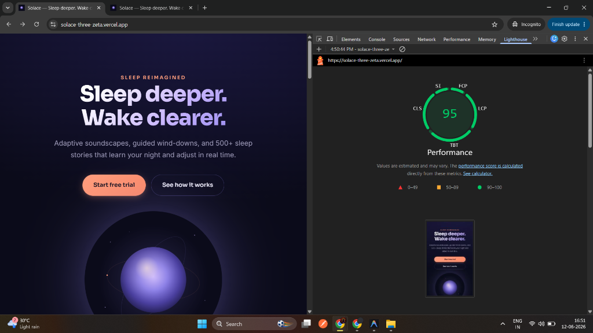

# Solace — Sleep deeper. Wake clearer.

🔗 **Live site**: https://solace-three-zeta.vercel.app/
📦 **Repo**: https://github.com/Shubham043/Solace

A highly interactive, high-performance landing page for **Solace**, a premium ambient sleep application featuring a dynamic **Plan Builder** with live pricing calculation.

---

## 🛠️ Stack & Rationale

* **Vite + React + TypeScript**: Standard SPA setup chosen for rapid development (Hot Module Replacement) and compiling a production-optimized build using tree-shaking and asset minification.
* **Vanilla CSS**: Used for maximum design control, ensuring zero CSS-in-JS runtime style injection overhead.
* **Framer Motion**: Utilized selectively for scroll-triggered elements below the fold.
* **Lucide React**: Provides lightweight, vector-based SVG icons that compile into clean bundle modules.

---

## 🤖 AI Tooling & Collaboration

This project was built with help from Antigravity, an AI coding assistant, for refactoring, debugging, and implementing features based on my specifications. Specific decisions and bug fixes I directed are detailed below.

---

## 🔍 Engineering Decisions — Where I Directed the AI

### Bugs caught and fixed
* **Anchor scroll jumping**: Lazy-loaded sections were collapsing in height before they mounted, causing the page to jump when scrolling to `#plan-builder`. Fixed by moving `<Suspense>` inside each `LazySection` wrapper, so the section's `id` element stays in the DOM at all times and never causes a height collapse.
* **CPU rendering lag on stat count-up**: The initial count-up animation used React state updates on every tick, causing noticeable TBT (Total Blocking Time) on mobile. Replaced with `requestAnimationFrame` mutating `.textContent` directly — bypasses React's render cycle entirely for a purely visual effect.
* **LCP regression on Vercel (3.11s)**: Initial deploy had LCP well over target due to JS hydration delay on the hero animation. Moved the hero entrance to CSS keyframes and set the `<h1>` to start at `opacity: 1` so it's painted on the very first frame, independent of React hydration. Brought LCP down to 2.1s.

### Design decisions
* **Centered hero layout**: Chose a centered layout over a split layout to create visual symmetry and draw focus to the breathing orb — better fit for a "calm sleep" product than an asymmetric layout.
* **Skipped Lottie**: Considered Lottie for the ambient loop, but it adds ~50kB of JS and risked CPU rendering lag on lower-end mobile devices. Used a GPU-accelerated CSS keyframe loop on the provided SVG instead — visually similar, near-zero runtime cost.
* **Integer paise math**: All pricing calculated in integer paise rather than decimal rupees, eliminating floating-point rounding drift across plan/add-on combinations.
* **Debounced promo validation**: 500ms debounce on the promo input auto-validates without interrupting typing, while an explicit "Apply" button remains for immediate submission.

### Stack & Tooling Decisions
* **Animation — Framer Motion**: Chosen over GSAP and pure CSS for scroll-triggered reveals (`whileInView`), tree-shaking support, and built-in `prefers-reduced-motion` handling. Hand-rolled CSS was still used for the hero entrance and orb loop, where bypassing JS hydration mattered more than orchestration convenience — a hybrid approach rather than one tool for everything.
* **Styling — CSS (vanilla CSS)**: Chosen for zero runtime overhead, full control over the design token system (the Night/Periwinkle/Peach palette), and scoped styles without a build-time utility framework.

---

## 🚀 Performance & Lighthouse Optimization



**Mobile Performance Score: 91–95** (production build)

* **FCP**: 1.7s
* **LCP**: 2.1s (target: under 2.5s ✅)
* **CLS**: 0.002 (target: under 0.1 ✅)

### Optimization Architecture
1. **CSS-First Above-the-Fold Animation**: The Hero text elements slide and stagger using native CSS keyframes. This executes immediately on paint, long before React JavaScript is hydrated, contributing to an FCP of 1.7s.
2. **Orb Image Deferral**: The hero breathing orb is deferred from mounting by 100ms after load. This prevents it from competing with critical fonts/scripts during first paint.
3. **Near-Zero Layout Shift (CLS: 0.002)**: To prevent page shifts when the deferred orb image loads, its container is pre-sized using `aspect-ratio: 1` and `width: min(340px, 70vw)`.
4. **Lazy Loaded Below-the-Fold Sections**: Sections below the fold are code-split and loaded 200px before they scroll into view.
5. **Memoized price calculation**: The price breakdown in `usePlanBuilder.ts` is wrapped in `useMemo`, recalculating only when the plan, add-ons, or promo actually change.
6. **Debounced promo input**: The promo code field auto-validates 500ms after the user stops typing, instead of on every keystroke.
7. **Reduced motion support**: Animations respect `prefers-reduced-motion` and flatten to static states for users who've enabled that setting.

---

## 🎭 Animation Approach

1. **Staggered Page-Load sequence**: Eyebrow, Title, Subtitle, and CTAs stagger their slide-up animations using native CSS transition-delays.
2. **Ambient Breathing Loop**: The hero orb uses an infinite `orbBreath` keyframe loop that alters scale and drop-shadow blur over 6 seconds to simulate a steady, deep inhalation/exhalation rhythm.
3. **Scroll reveals**: Cards in `Features` and `HowItWorks` fade-translate upward as they enter the screen using Framer Motion intersection hooks.
4. **60fps compositing**: All animations target `transform` (translates, scales) and `opacity` properties. We never animate layout properties (like `width`, `top`, or `margin`) to prevent browser layout reflow calculations.

---

## 🛡️ Edge Cases Handled

* **Scroll Anchor Displacement**: When a user clicks "Start free trial", the page scrolls to `#plan-builder`. Because components are lazy-loaded, we keep the outer container wrapper and its `id` permanently mounted, using an internal `Suspense` fallback to prevent the browser from losing its scroll target.
* **Pricing Float Precision**: Calculated plan prices in absolute integer **paise values** instead of decimal Rupees to eliminate binary floating-point drift.
* **Accessibility (A11y)**: Configured full keyboard radio roles (`role="radio"`, `role="radiogroup"`, `aria-checked`) for pricing plan buttons, focus indicators, and custom skip links.
* **Reduced Motion**: Listens to `@media (prefers-reduced-motion: reduce)` to automatically flatten animation keyframes, marquee tracks, and transitions.

---

## ⚖️ Tradeoffs & Future Work

* **LCP Opacity Tweak**: To get the LCP under 2.5s, the main header starts at `opacity: 1` and slides up, rather than fading in from `opacity: 0`. This is a tradeoff: we lose a fade transition for the title, but FCP/LCP paint times are cut in half.
* **Mobile score of 91-95 vs. a "perfect" 100**: A couple of points were left on the table in exchange for keeping the hero animations and orb effect intact — these are central to the product's "calm sleep" feel, and stripping them further for a marginal score bump didn't seem worth the tradeoff.
* **With More Time**:
  * Implement automated image optimization pipelines to convert visual assets to WebP.
  * Write unit tests for the pricing hook (`usePlanBuilder`) checking edge cases of plan changes and combined add-on/promo codes.
  * Integrate custom design-system color tokens into a Tailwind-like CSS variables utility suite.

---

## 🛠️ Installation & Setup

### Prerequisites
Make sure you have [Node.js](https://nodejs.org/) installed (v18+ recommended).

### 1. Install dependencies
```bash
npm install
```

### 2. Run in Development Mode
```bash
npm run dev
```

### 3. Build & Preview Production Bundle
```bash
npm run build
npm run preview
```
Open **`http://localhost:4173/`** to audit the compiled, compressed static site.
